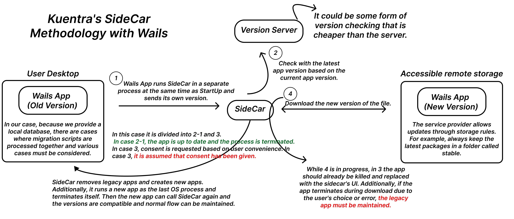
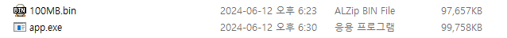
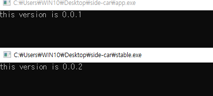
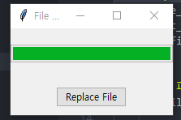
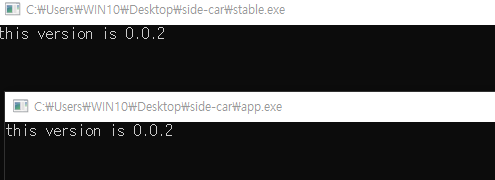

# What is the SideCar methodology?

The SideCar methodology is an alternative approach devised by Kuentra for automatic updates, specifically designed to address the absence of such features in their desktop application product based on Wails.

## Why Wails?


#### wails_link => https://github.com/wailsapp/wails

Wails is a cross-platform framework that combines Go with various front-end technologies to build desktop applications. Our team is proficient in Go, and it proved to be well-suited for integrating various embedded systems. Unfortunately, the current version lacks the ability to remotely or automatically update the app. Although there are abundant considerations to switch to Electron in the future, it is not feasible at the moment. Therefore, we sought to resolve the issue with automatic updates that we are currently facing.

## Back to Our Approach


Our approach is straightforward. It simply implements the concept of automatic updates in a rudimentary and perhaps crude manner. Sidecar acts literally as an aide, invoked from the cmd processor of the Wails app. It then presents the app version, and if an update is available, it seeks user consent to delete the legacy version and update the app to the new version. Of course, like in our case where there is an internal database or various special features like checkpoints, these aspects must also be considered.

## Proof of Concept

1. Initial Build: We first built a virtual app of approximately 100MB, which mirrors the actual app's deployment size. This size was neither too light nor excessively heavy, artificially increased using embed.
   

2. Dual Builds: We performed two builds, which in the scenario will represent the older version and the latest version.
   
3. Download and Replacement Capability: Our code allows us to download and replace files, a process that must be refined and adapted to various scenarios in actual implementation.

```python
import tkinter as tk
from tkinter import ttk
import os
import tempfile
def replace_file():
    # replace aws or gcp, when aws, using boto3
    source_file = 'stable.exe'
    target_file = 'app.exe'
    temp_file = os.path.join(tempfile.gettempdir(), os.urandom(24).hex())

    try:
        file_size = os.path.getsize(source_file)

        progress_bar['value'] = 0
        progress_bar["maximum"] = file_size

        with open(source_file, 'rb') as fsrc, open(temp_file, 'wb') as fdst:
            copied = 0
            while True:
                buffer = fsrc.read(1024*1024)
                if not buffer:
                    break
                fdst.write(buffer)
                copied += len(buffer)
                update_progress(copied)

        os.replace(temp_file, target_file)
        print("File replacement completed.")
    except Exception as e:
        print(f"An error occurred: {e}")

def update_progress(copied):
    progress_bar['value'] = copied
    root.update_idletasks()

root = tk.Tk()
root.title("File Replacer")

progress_bar = ttk.Progressbar(root, length=200, mode='determinate')
progress_bar.pack(pady=20)

replace_button = ttk.Button(root, text="Replace File", command=replace_file)
replace_button.pack(pady=10)

root.mainloop()
```

 4. Version Updating: In this scenario, you can observe the binary being replaced with the latest version.

